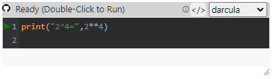
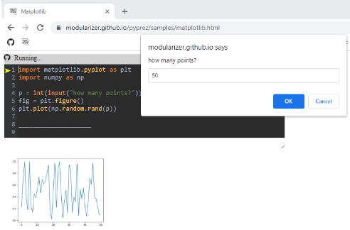
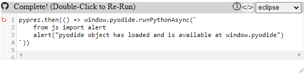
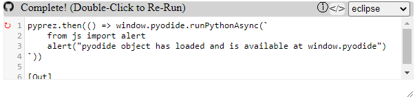
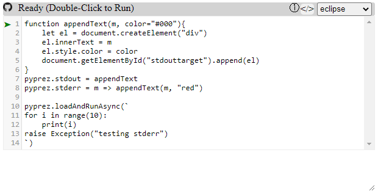

<script src="https://modularizer.github.io/pyprez/pyprez.js"></script>

# Welcome to **pyprez!**
Run **client-side python** in your browser to **prez**ent your code.

<a href="https://github.com/modularizer/pyprez"></a>
[GitHub Project](https://github.com/modularizer/pyprez) (go to project)<br/>

<a href="https://github.com/modularizer/pyprez"></a>
[GitHub Source](https://github.com/modularizer/pyprez/blob/master/pyprez.js) (inspect code)<br/>

<a href="https://modularizer.github.io/pyprez"></a>
[GitHubPages](https://modularizer.github.io/pyprez) (interactive README)<br/>

<a href="mailto:modularizer@gmail.com&subject=PyPrez%20Comments"></a>
<a href="mailto:modularizer@gmail.com&subject=PyPrez%20Comments">Contact</a>(I'd love to hear feedback on ideas on how to make this better!)


## Sample
```html
<script src="https://modularizer.github.io/pyprez/pyprez.min.js">
    print("2^4=",2**4)
</script>
```

<a href="https://modularizer.github.io/pyprez" class="nonrendered"></a>
<a href="https://modularizer.github.io/pyprez" class="nonrendered">Try on live page</a>

<a href="https://modularizer.github.io/pyprez" class="nonrendered"></a>

## Quick Links:
- [StackOverflow](#use-on-stackoverflow)
- [About](#about)
- [Getting Started](#getting-started)
- [Use Cases](#use-cases)
- [Limitations](#limitations)
- [Micropip](#micropip)
- [Tags](#pyprez-tags): [`<pyprez-editor>`](#pyprez-editor) , [`<pyprez-console>`](#pyprez-console), [`<pyprez-import>`](#pyprez-import), [`<pyprez-script>`](#pyprez-script)
- [Custom Themes](#codemirror-themes)
- [Feature Development](#feature-development)
  - [namespaces](#namespaces)
  - [input](#input)
  - [matplotlib](#matplotlib)
  - [linting](#linting)
- [Keyboard Shortcuts](#keyboard-shortcuts)
- [API](#pyprez-api)
- [Pyodide](#pyodide)
- [PyScript](#pyscript)
- Samples
  - [Minimal](https://modularizer.github.io/pyprez/samples/min.html)
  - [StackOverflow Converter](https://modularizer.github.io/pyprez/samples/stackconverter.html)
  - [Editors](https://modularizer.github.io/pyprez/samples/console.html)
  - [Namespaces](https://modularizer.github.io/pyprez/samples/namespaces.html)
  - [Console](https://modularizer.github.io/pyprez/samples/console.html)
  - [Script](https://modularizer.github.io/pyprez/samples/script.html)

# Use On Stack Overflow

<a href="https://stackoverflow.com/search?q=pyprez"></a>
<a href="https://stackoverflow.com/search?q=pyprez">View Real Answers</a>


## Method 1
Using any `<prprez-editor>` element (such as the one [here](https://modularizer.github.io/pyprez/samples/stackconverter.html)) to modify your code, then click `M↓` button on the top bar to convert your python 
into markdown which can be pasted into your StackOverflow answer to create a **runnable and editable snippet**.

**The Question/Answer Editor will look something like this**


## Method 2
Use this [Converter Page](https://modularizer.github.io/pyprez/samples/stackconverter.html)
<stack-converter id="stackplaceholder"></stack-converter>

<a href="https://modularizer.github.io/pyprez#method-2" class="nonrendered">

</a>

## Method 3
### Setup Bookmark
Add a bookmark to your browser with the following text as the url.

```text
    javascript:(()=>{
	let sel=window.getSelection().toString().split("\n").join("\n    ");
	if (sel.startsWith('```python')){sel = sel.replace('```python', '').slice(0,-3)};
	navigator.clipboard.writeText(`
\x3C!-- begin snippet: js hide: false console: false babel: false -->
\x3C!-- language: lang-js -->
    #!/usr/bin/env python\n
    ${sel}
\x3C!-- language: lang-html -->
    \x3Cscript src="https://modularizer.github.io/pyprez/pyprez.min.js" theme="darcula">\x3C/script>
\x3C!-- end snippet -->
`)})()
```
   * `Ctrl + D` to save bookmark of this page (for Chrome)
   * Right click on existing bookmark of this page, click edit, then replace bookmark url with the text copied from above 

#### Highlight->Click->Paste
* on any webpage highlight the python codeblock you want to use and click the bookmark to copy markdown to clipboard
* paste the markdown into your stackoverflow answer


   
## Method 4:
### step 1

* click to add a runnable code segment

### step 2


1.  disable console logging
2. paste the following into HTML or click `Add an external library` just the url
    ```text
    <script src="https://modularizer.github.io/pyprez/pyprez.min.js"></script>
    ```
3. write your python in the javascript box
  * make sure to add a comment or an import to the top of the python script (`# python` works). This will throw a javascript error and ensure the code runs only as python

   
### Other options
[PySnippet](https://github.com/pysnippet/pysnippet) is a super concise package which also allows you to demo python code on stack overflow.

# About
**pyprez** is a minimal _javascript_ package which allows you to **present** runnable python samples in the browser.
 
The functionality comes primarily from [**Pyodide**](#pyodide), 
which allows you to run **front-end Python** through **WebAssembly** and easily interact between Python, javascript and HTML.
The pyodide object is made available at `window.pyodide`.
Meanwhile much of the visual style is provided by [CodeMirror](https://codemirror.net/) (accessible at `window.CodeMirror`).

**pyprez** is inspired [**Pyscript**](#pyscript), a project backed by Anaconda which provided a useful interface for 
pyodide also but introduced a [list of drawbacks](#pyscript-drawbacks) in the process.


# Getting Started
**Double-Click or press Green Arrow to run code**
```html
<script src="https://modularizer.github.io/pyprez/pyprez.js" mode="editor">
    import numpy as np
    print("testing")
    np.random.rand(5)
</script>
```
<a href="https://modularizer.github.io/pyprez/#getting-started" class="nonrendered"></a>
<a href="https://modularizer.github.io/pyprez/#getting-started" class="nonrendered">Try on live page</a>
<a href="https://modularizer.github.io/pyprez/#getting-started" class="nonrendered">

</a>

**NOTE: If this is the first time using pyodide on your device, it will take extra long to load (especially on mobile)**

Options:
* `mode="editor"(default),"console","script","import"`
* `stdout="true"(default)(logs to textbox), or "false"(logs to console)`

<div class="nonrendered">
    <b>NOTE:</b>
    <p>
Some markdown flavors, github included, disable javascript, so these examples will not work on GitHub. Luckily, they
work on GitHub Pages, so if you click the static image it will take you to the working example.
    </p>
</div>

# Use Cases
Some cool things about **pyodide** which **pyprez** takes advantage of are:
* it runs a real python interpreter
* a webpage visitor running python uses no server-side computational resources after loading the page
* no server is needed! it will work if you open a `.html` document in your browser
* code execution is sandboxed in the webpage visitor's browsers, making it _relatively safe_ for a webpage host to 
  allow users to write and run their own code (because it runs on the client's machine it doesn't pose a security risk to the server)
* allows combining python computations with pretty `HTML/JS/CSS`

I don't expect front-end python to replace back-end python or front-end javascript, but it does have some unique
advantages for certain use cases:
* **troubleshooting code** on forums such as stackoverflow <a href="https://stackoverflow.com/questions/67189446/difference-between-setattr-and-dict/67189534#67189534"></a><a href="https://stackoverflow.com">StackOverflow</a>
* making Python **tutorials** (similar to `jupyter` of `CoLab`)
* writing **articles** about new Python features
* providing **interactive documentation** for a package
* distributing results of **scientific studies** and allowing users to play around with data (this is what Pyodide was made for)

# Limitations
Unfortunately, there are currently many limitations of running Python in the browser, which stem from fundamental issues.
Many of PyPrez's limitations stem from limitations of `Pyodide`, the package on which it is built.
Pyodide's limitations which in turn stem from limitiations of `js`, `Emscriptem`, `WebAssembly`, and browsers in general.
Some such limitations are:
* many packages are not supported
* `time.sleep` is not supported
* `threading` is not supported
* cannot access the local file system ( but can still read and write temporary files in webassembly)
* `__builtins__.input` is tricky. Currently it works with the fully blocking `window.prompt` function

# Micropip
The `micropip` object from pyodide is available at `window.pyodide`. Furthermore, `<pyprez-editor>` will autorecognize 
comments like `# micropip install package_name` and call `micropip.install('package_name')`before running your code.

# Pyprez Tags
## Pyprez-Editor
 The `<pyprez-editor>` tag provides a [CodeMirror](https://codemirror.net/6/) text editor element and does not execute until 
 it is double-clicked (useful on mobile) or the green start button has been pressed. 
 Then, the editor runs the code in the browser, streaming STDOUT and STDERR to either the text box or the console 
 if `stdout="false"` is set, and the displays the result as a string in the editor. 
 Additionally, the element can be reset and the code can be modified and rerun.
 
 By default, the `<pyprez-editor>` tag evaluates Python in pyodide's CPython interpreter, 
 but if the `language` attribute is set to "javascript" or if the src address ends with `.js`, 
 the editor will run the code in javascript instead.
 
### pyprez-editor example
 ```html
 <pyprez-editor>
    import numpy as np
	np.random.rand(5)
</pyprez-editor>
```
<a href="https://modularizer.github.io/pyprez/#pyprez-editor-example" class="nonrendered"></a>
<a href="https://modularizer.github.io/pyprez/#pyprez-editor-example" class="nonrendered">Try on live page</a>
<a href="https://modularizer.github.io/pyprez/#pyprez-editor-example" class="nonrendered">

</a>


### javascript example

```javascript
pyprez.loadAndRunAsync(`
	from js import alert
	alert('pyodide object has loaded and is available at window.pyodide')
`)
```
<a href="https://modularizer.github.io/pyprez/#pyprez-editor-example" class="nonrendered"></a>
<a href="https://modularizer.github.io/pyprez/#pyprez-editor-example" class="nonrendered">Try on live page</a>
<a href="https://modularizer.github.io/pyprez/#pyprez-editor-example" class="nonrendered">

</a>


## pyprez-console
 The `<pyprez-console>` tag provides a minimal terminal emulator to play around with `pyodide`. 
 It does the very basics and nothing more (no special color strings, no plots, etc.). 
 It can be styled, but that is about it.
 
 [Pyodide's own console](https://pyodide.org/en/stable/console.html)  has much more support.

#### pyprez-console example
[View in GitHub Pages](https://modularizer.github.io/pyprez#pyprez-consoleexample)
```html
<pyprez-console></pyprez-console>
```
<a href="https://modularizer.github.io/pyprez/#pyprez-console-example" class="nonrendered"></a>
<a href="https://modularizer.github.io/pyprez/#pyprez-console-example" class="nonrendered">Try on live page</a>
<a href="https://modularizer.github.io/pyprez/#pyprez-console-example" class="nonrendered">

</a>
```html
<pyprez-console rows="10" cols="80"></pyprez-console>
```
<a href="https://modularizer.github.io/pyprez/#pyprez-console-example" class="nonrendered"></a>
<a href="https://modularizer.github.io/pyprez/#pyprez-console-example" class="nonrendered">Try on live page</a><br/>
<a href="https://modularizer.github.io/pyprez/#pyprez-console-example" class="nonrendered">

</a>
 
## pyprez-import
The `<pyprez-import>` tag allows you to load libraries using 
[pyodide.loadPackage](https://pyodide.org/en/stable/usage/api/js-api.html#pyodide.loadPackage) function.
Accepted inputs are either innerHTML or a `src` attribute linking to a file like a `requirements.txt`. 
This tag is not totally necessary because the `pyprez.loadAndRunAsync` function handles loading package dependencies 
via [`pyodide.loadPackageFromImports`](https://pyodide.org/en/stable/usage/api/js-api.html?highlight=loadpac#pyodide.loadPackagesFromImports).

The package names are selected from the text using the regular expression
[/\s*-?\s*(.*?)\s*[==[0-9|.]*]?\s*[,|;|\n]/g](https://regex101.com/r/fwHF7T/1) 


**note**: *the `==version` syntax used by `pip freeze` is ignored by the RegExp above, 
so specifying versions will not cause an error, but will not actually load that particular version, 
because this is not supported by pyodide*

#### pyprez-import example
 ```html
 <pyprez-import>
	- numpy
	- datetime
</pyprez-import>
```

```html
 <pyprez-import src="./requirements.txt"></pyprez-import>
 ```

## Pyprez-Script
 The `<pyprez-script>` tag allows you to run Python code using `pyprez.loadAndRunAsync`, which uses 
 [`pyodide.loadPackageFromImports`](https://pyodide.org/en/stable/usage/api/js-api.html?highlight=loadpac#pyodide.loadPackagesFromImports) 
 followed by [`pyodide.runPythonAsync`](https://pyodide.org/en/stable/usage/api/js-api.html?highlight=runpythona#pyodide.runPythonAsync). 
 Accepted inputs are either innerHTML or a `src` attribute linking to a python file.

#### pyprez-script example
```html
 <pyprez-script id="testScript">
	 from js import document
	 import datetime
	 
	 el = document.getElementById("testScript")
	 el.style.display = "block"
	 el.innerText = str(datetime.datetime.now().isoformat())
</pyprez-script>
```
<a href="https://modularizer.github.io/pyprez/#pyprez-script-example" class="nonrendered"></a>
<a href="https://modularizer.github.io/pyprez/#pyprez-script-example" class="nonrendered">Try on live page</a>
<div class="nonrendered">
2022-10-15T13:31:46.386000
</div>

# CodeMirror Themes
set the `theme` attribute of the `script` import element or `pyprez-editor` element to use a special CodeMirror theme, 
e.g. `theme="darcula"`. You can also select from a few themes using the dropdown.

## Let the user choose!!
If `theme` is not specified on an element, the page will use `localStorage` to identify the last saved preferred theme of the client!
Unfortunately on StackOverflow the code snippets are isolated in such a way that this does not work :/

see available themes at https://codemirror.net/5/demo/theme.html 

### python example

 ```html
 <pyprez-editor theme="darcula">
	 import numpy as np
	 np.random.rand(5)
</pyprez-editor>
```
<a href="https://modularizer.github.io/pyprez/#codemirror-themes" class="nonrendered"></a>
<a href="https://modularizer.github.io/pyprez/#codemirror-themes" class="nonrendered">Try on live page</a>
<a href="https://modularizer.github.io/pyprez/#codemirror-themes" class="nonrendered">

</a>


# Feature Development
## namespaces
If you have multiple `pyprez-editor` elements on the same page, namespaces let you set which ones should share variable 
scopes and which ones should not. Simply set the `namespace` attribute on elements, and if you wish to change them live,
set the `showNamespaceSelect` attribute on the script which imports `pyprez.js`.
[Namespace Demo](https://modularizer.github.io/pyprez/samples/namespaces.html)

### Yet To Come
* import other namespaces
* relative imports to load other python files based on the `src`

## input
The input function is tricky. For now, we have gotten it to call the builtin js `prompt` popup.

### Yet To Come
* imitate the typical inline input

## matplotlib
We have applied a patch which runs only if `matplotlib` is imported. It overwrites the `plt.plot` function and the `Figure.savefig`
to save the figure to a temporary png, convert to a base64 dataURI, and set that as the `src` of an img to display the figure.

Making it interactive would be tough (but not impossible). Bokeh and Plotly are supported and may be the easier route.

### Yet To Come
* interactivity (TBD whether or not this will happen)

```html
<pyprez-editor>
    import matplotlib.pyplot as plt
    import numpy as np
    
    p = int(input("how many points?"))
    fig = plt.figure()
    plt.plot(np.random.rand(p))
</pyprez-editor>
```


<a href="https://modularizer.github.io/pyprez/#matplotlib" class="nonrendered"></a>
<a href="https://modularizer.github.io/pyprez/#matplotlib" class="nonrendered">Try on live page</a><br/>
<a href="https://modularizer.github.io/pyprez/#matplotlib" class="nonrendered">

</a>


## Linting
### autopep8
`Ctrl+k` can be used to auto-format code to pep8 standards. `Ctrl+Z` will undo.


# Keyboard Shortcuts
custom:
* `Ctrl + k`: autopep8.fix_file
* `Shift + Enter`: run code
* `Shift + Backspace`: reset code

builtin to codemirror:
* `Ctrl + z`
* `Ctrl + a`
* `Ctrl + c`

# Pyprez API
## elements
Any html elements created by the pyprez custom tags get added to `pyprez.elements` object for easy retrieval.
Further, `<pyprez-editor>` elements can be accessed from `pyprez.editors`, `<pyprez-console>` from `pyprez.consoles`, etc.

## then/catch
When `pyprez.js` loads, the `pyprez` object (available at `window.pyprez`) creates a 
[Promise](https://developer.mozilla.org/en-US/docs/Web/JavaScript/Reference/Global_Objects/Promise) at `pyprez.promise`,
which then resolves with `true` when 
[`loadPyodide`](https://pyodide.org/en/stable/usage/api/js-api.html?highlight=loadPyodide#globalThis.loadPyodide) 
finishes loading the `pyodide` object.

`pyprez.then` and `pyprez.catch` are simply shortcuts to `pyodidePromise.then` and `pyodidePromise.catch`. 
Therefore, `pyprez.then` can be use be sure that pyodide has finished loading, then use it as soon as possible.

#### javascript example

```javascript
pyprez.then(() => window.pyodide.runPythonAsync(`
	from js import alert
	alert("pyodide object has loaded and is available at window.pyodide")
`))
```
<a href="https://modularizer.github.io/pyprez/#thencatch" class="nonrendered"></a>
<a href="https://modularizer.github.io/pyprez/#thencatch" class="nonrendered">Try on live page</a>
<a href="https://modularizer.github.io/pyprez/#thencatch" class="nonrendered">

</a>

## loadAndRunAsync
The `pyprez.loadAndRunAsync` function is an asynchronous utility function which immediately returns a 
Promise to the result of some Python code, which gets evaluated as soon as possible. 
It works by doing does three things:
- waits for pyodide to finish loading by using [`pyprez.then`](#then/catch)
- loads any packages the code snippet requires, by using [`pyodide.loadPackagesFromImports`](#https://pyodide.org/en/stable/usage/api/js-api.html?highlight=loadpackagesfromimports#pyodide.loadPackagesFromImports)
- runs python in pyodide's [CPython interpreter](https://en.wikipedia.org/wiki/CPython) using [WebAssembly](https://webassembly.org/) via [`pyodide.runPythonAsync`](https://pyodide.org/en/stable/usage/api/js-api.html?highlight=runPythonAsync#pyodide.runPythonAsync)

#### javascript example

```javascript
pyprez.loadAndRunAsync(`
	from js import alert
	alert("pyodide object has loaded and is available at window.pyodide")
`)
```
<a href="https://modularizer.github.io/pyprez/#loadandrunasync" class="nonrendered"></a>
<a href="https://modularizer.github.io/pyprez/#loadandrunasync" class="nonrendered">Try on live page</a>
<a href="https://modularizer.github.io/pyprez/#loadandrunasync" class="nonrendered">

</a>

## stdout/stderr
Pyprez automatically set up `stdout` to be handled by `console.log` and `stderr` to be handled by `console.err` by setting configuration options in `loadPyodide`.
However, `pyprez.stdout` and `pyprez.stderr` functions can be set to whatever handler you want.

#### javascript example

```javascript
function appendText(m, color="#000"){
	let el = document.createElement("div")
	el.innerText = m
	el.style.color = color
	document.getElementById("stdouttarget").append(el)
}
pyprez.stdout = appendText
pyprez.stderr = m => appendText(m, "red")

pyprez.loadAndRunAsync(`
for i in range(10):
	print(i)
raise Exception("testing stderr")
`)
```
<a href="https://modularizer.github.io/pyprez/#stdoutstderr" class="nonrendered"></a>
<a href="https://modularizer.github.io/pyprez/#stdoutstderr" class="nonrendered">Try on live page</a>
<a href="https://modularizer.github.io/pyprez/#stdoutstderr" class="nonrendered">

</a>


## Pyodide
[**Pyodide**](https://pyodide.org/en/stable/) is a super cool project which uses
[**Empscripten**](https://emscripten.org/index.html) to compile and run a
[**CPython interpreter**](https://en.wikipedia.org/wiki/CPython) in the browser using 
[**WebAssembly**](https://webassembly.org/).

`pyodide` provides access to[**WebAPIs**](https://developer.mozilla.org/en-US/docs/Web/API) ( such as `window`, `document`, etc. ) and all of your
**javascript** objects, functions, etc. from **Python** and also allows accessing and setting python variables from javascript.
In reality, **Pyodide** provides `~99.9%` of the utility of **Pyprez**, which just provides a user interface.

**Pyodide** is a great foundation  with cool features, [**great documentation**](https://pyodide.org/en/stable/) and lots of potential use cases mostly related to:

 * offloading computations to browsers to reduce server resources
 * speeding up slow client-side computations (especially ones which can be [vectorized](https://www.intel.com/content/www/us/en/developer/articles/technical/vectorization-a-key-tool-to-improve-performance-on-modern-cpus.html)) 
 * distributing research and data analysis documents (this was the goal of the now-deprecated [Iodide Project](https://github.com/iodide-project/iodide) from which Pyodide originated)
 * allowing Python developers to dabble in web development a bit easier

Pyodide is not yet fully fledged, and is still working on features such as `threading`, 
calling blocking functions such as `time.sleep`, and allowing using multiple web workers to run code.
  
## PyScript
**Pyprez** is heavily inspired by [**PyScript**](https://pyscript.net/), 
a project recently endorsed by [Anaconda](https://anaconda.cloud/pyscript-python-in-the-browser) (May 2022), 
which is built on top of Pyodide and attempts to make Pyodide easier to use by providing 
[custom HTML tags](https://developer.mozilla.org/en-US/docs/Web/Web_Components/Using_custom_elements) 
such as `py-env`, `py-script` and `py-repl` and by allowing users to easily display plots and graphs using 
[matplotlib](https://matplotlib.org/3.5.0/gallery/index.html) and other similar popular Python Libraries.

### PyScript drawbacks
I believe that [**PyScript**](https://pyscript.net/) may _eventually_ become the state of the art for Python in the browser. 
For now though, they have set their sights too high and failured to deliver. As of May 2022, there were many critical issues:
* very slow load times of (10-30s)
* poor documentation
* Their own [Hello World example](https://pyscript.net/examples/hello_world.html) for PyScript did not work
* the `pyodide` object which Pyscript is based off of is not easily provided to the user as a `window` variable, 
  `loadPyodide()` does not allow reloading of the `pyodide` object, and no documented interface to `pyodide` is provided, 
   meaning the user loses out on most of pyodide's javascript API and versatility

PyScript seems to be so focused on making web development "accessible" to Python developers, 
that they ended up removing most of the Pyodide functionality developers are looking for and 
instead made a **slow, bulky, buggy, front-end version of a [Jupyter notebook](https://jupyter.org/).**

PyScript has improved and will continue to get better, and I look forward to a day when it is simple to use, well documented,
and easy to extend. For now though, I hope you enjoy this alternative!


<details style="display:none">
	<summary>Scripts which make GitHub Pages page interactive</summary>
	<script>
        let samples = Array.from(document.querySelectorAll('.nonrendered'));
        samples.map(el=>{el.style.display="none"});

        let fav = document.createElement("link");
        fav.setAttribute("rel","icon");
        fav.setAttribute("type","image/x-icon");
        fav.setAttribute("href", "https://modularizer.github.io/pyprez/favicon.ico");
        document.head.appendChild(fav);


        let scripts = Array.from(document.querySelectorAll('.language-html'));

        let i = 0;
        scripts.map(el=>{
            let parent = document.createElement("div");
            if (i>1){
                parent.innerHTML = el.innerText.replaceAll("\x3C","<");
            }else if (i==1){
                parent.innerHTML = `<pyprez-editor mode="editor">
                    import numpy as np
                    print("testing")
                    np.random.rand(5)
                </pyprez-editor>`
            }else if (i==0){
                el.outerHTML = `<pyprez-editor mode="editor">
                    print("2^4=",2**4)
                </pyprez-editor>`
            }
            el.after(parent);
            i += 1;
        })

        let jscripts = Array.from(document.querySelectorAll('.language-javascript'));
        jscripts.map(el=>{
            let parent = document.createElement("div");
            let content = el.innerText;
            
            parent.innerHTML = `<pyprez-editor language="js">${content}</pyprez-editor>`
            console.log(parent)
            el.after(parent);
        })
	</script>
</details>
 
