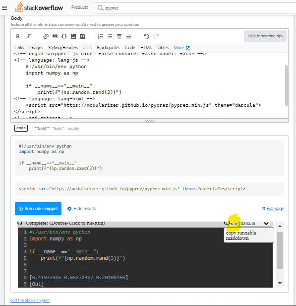
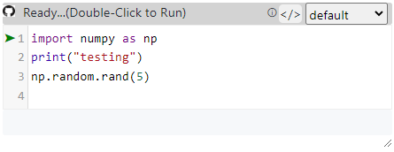
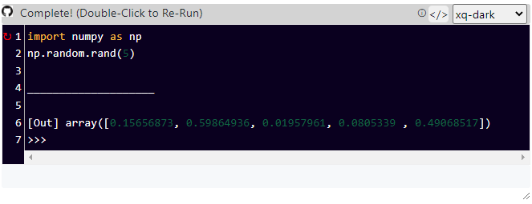

# Welcome to **pyprez!**
Run **client-side python** in your browser to **prez**ent your code.

<a href="https://github.com/modularizer/pyprez"></a>
[GitHub](https://github.com/modularizer/pyprez) (view source code)<br/>

<a href="https://modularizer.github.io/pyprez"></a>
[GitHubPages](https://modularizer.github.io/pyprez) (interactive README)<br/>

<a href="mailto:modularizer@gmail.com&subject=PyPrez%20Comments"></a><a href="mailto:modularizer@gmail.com&subject=PyPrez%20Comments">Contact</a> I'd love to here feedback on ideas on how to make this better!


## Quick Links:
- [StackOverflow](#use-on-stackoverflow)
- [About](#about)
- [Getting Started](#getting-started)
- [Use Cases](#use-cases)
- [Tags](#pyprez-tags): [`<pyprez-editor>`](#pyprez-editor) , [`<pyprez-console>`](#pyprez-console), [`<pyprez-import>`](#pyprez-import), [`<pyprez-script>`](#pyprez-script)
- [Custom Themes](#codemirror-themes)
- [API](#pyprez-api)
- [Pyodide](#pyodide)
- [PyScript](#pyscript)

# Use On Stack Overflow
## Method 1:
### step 1

* click to add a runnable code segment

### step 2


1.  disable console logging
2. paste the following into HTML or click `Add an external library` just the url
    ```html
    <script src="https://modularizer.github.io/pyprez/so.js"></script>
    ```
3. write your python in the javascript box
  * make sure to add a comment or an import to the top of the python script (`# python` works). This will throw a javascript error and ensure the code runs only as python

## Method 2
Convert your code here then copy-paste result into your question/answer. [Converter-Only Page](https://modularizer.github.io/pyprez/stackconverter.html)
<stack-converter id="stackplaceholder"></stack-converter>


**If** the viewer clicks `Run Code Snippet`, they will be able to edit and
test a live python question/answer without leaving the page.

**It will render something like this**


<a href="https://stackoverflow.com/questions/67189446/difference-between-setattr-and-dict/67189534#67189534" class="nonrendered"></a>
<a href="https://stackoverflow.com/questions/67189446/difference-between-setattr-and-dict/67189534#67189534" class="nonrendered">View a real answer</a>

## Method 3 
### StackOverflow Power User?
1. Add a bookmark to your browser with the following text as the url.
    ```
    javascript:(()=>{let sel=window.getSelection().toString().split("\n").join("\n    ");if (sel.startsWith('```python')){sel = sel.replace('```python', '').slice(0,-3)} navigator.clipboard.writeText('\n\n\x3C!-- begin snippet: js hide: false console: false babel: false -->\n\n\x3C!-- language: lang-js -->\n\n    # py\n    ' + sel + '\n\x3C!-- language: lang-html -->\n\n    \x3Cscript src="https://modularizer.github.io/pyprez/so.js">\x3C/script>\n\n\n\x3C!-- end snippet -->')})()
    ```
2. highlight the python codeblock you want to use
3. click on the bookmark
4. paste to replace the highlighted text


### Other options
[PySnippet](https://github.com/pysnippet/pysnippet) is a super concise package which also allows you to demo python code on stack overflow.

## About
**pyprez** is a minimal _javascript_ package which allows you to **present** runnable python samples in the browser.
 
The functionality comes primarily from [**Pyodide**](#pyodide), 
which allows you to run **front-end Python** through **WebAssembly** and easily interact between Python, javascript and HTML.
The pyodide object is made available at `window.pyodide`.
Meanwhile much of the visual style is provided by [CodeMirror](https://codemirror.net/) (accessible at `window.CodeMirror`).

**pyprez** is inspired [**Pyscript**](#pyscript), a project backed by Anaconda which provided a useful interface for 
pyodide also but introduced a [list of drawbacks](#pyscript-drawbacks) in the process.


# Getting Started
**Double-Click or press Green Arrow to run code**
```html
<script src="https://modularizer.github.io/pyprez/pyprez.js" mode="editor">
    import numpy as np
    print("testing")
    np.random.rand(5)
</script>
```
<a href="https://modularizer.github.io/pyprez/#gettingstarted" class="nonrendered"></a>
<a href="https://modularizer.github.io/pyprez/#gettingstarted" class="nonrendered">Try on live page</a>
<a href="https://modularizer.github.io/pyprez/#gettingstarted" class="nonrendered">

</a>

**NOTE: If this is the first time using pyodide on your device, it will take extra long to load (especially on mobile)**

Options:
* `mode="editor"(default),"console","script","import"`
* `stdout="true"(default)(logs to textbox), or "false"(logs to console)`

<div class="nonrendered">
    <b>NOTE:</b>
    <p>
Some markdown flavors, github included, disable javascript, so these examples will not work on GitHub. Luckily, they
work on GitHub Pages, so if you click the static image it will take you to the working example.
    </p>
</div>

# Use Cases
Some cool things about **pyodide** which **pyprez** takes advantage of are:
* it runs a real python interpreter
* a webpage visitor running python uses no server-side computational resources
* no server is even needed, it will work if you open a `.html` document in your browser
* code execution is sandboxed in the webpage visitor's browsers, making it _relatively safer_ for a webpage host to 
  allow users to write and run their own code (because it runs on the client's machine it doesn't pose a security risk to the server)
* allows combining python computations with pretty `HTML/JS/CSS`

Front-end Python will never replace back-end computations, but may be useful for:
* making Python tutorials (similar to `jupyter` of `CoLab`)
* distributing results of scientific studies and allowing users to play around with data
* troubleshooting of forums such as stackoverflow <a href="https://stackoverflow.com/questions/67189446/difference-between-setattr-and-dict/67189534#67189534"></a><a href="https://stackoverflow.com">StackOverflow</a>

# Pyprez Tags
## Pyprez-Editor
 The `<pyprez-editor>` tag provides a [CodeMirror](https://codemirror.net/6/) text editor element and does not execute until 
 it is double-clicked (useful on mobile) or the green start button has been pressed. 
 Then, the editor runs the code in the browser, streaming STDOUT and STDERR to either the text box or the console 
 if `stdout="false"` is set, and the displays the result as a string in the editor. 
 Additionally, the element can be reset and the code can be modified and rerun.
 
 By default, the `<pyprez-editor>` tag evaluates Python in pyodide's CPython interpreter, 
 but if the `language` attribute is set to "javascript" or if the src address ends with `.js`, 
 the editor will run the code in javascript instead.
 
### pyprez-editor example
 ```html
 <pyprez-editor>
    import numpy as np
	np.random.rand(5)
</pyprez-editor>
```
<a href="https://modularizer.github.io/pyprez/#pyprez-editor-example" class="nonrendered"></a>
<a href="https://modularizer.github.io/pyprez/#pyprez-editor-example" class="nonrendered">Try on live page</a>
<a href="https://modularizer.github.io/pyprez/#pyprez-editor-example" class="nonrendered">

</a>

 ```html
 <pyprez-editor src="./sample_front_end_python.py"></pyprez-editor>
```

### javascript example

```javascript
pyprez.loadAndRunAsync(`
	from js import alert
	alert('pyodide object has loaded and is available at window.pyodide')
`)
```
<a href="https://modularizer.github.io/pyprez/#pyprez-editor-example" class="nonrendered"></a>
<a href="https://modularizer.github.io/pyprez/#pyprez-editor-example" class="nonrendered">Try on live page</a>
<a href="https://modularizer.github.io/pyprez/#pyprez-editor-example" class="nonrendered">

</a>


## pyprez-console
 The `<pyprez-console>` tag provides a minimal terminal emulator to play around with `pyodide`. 
 It does the very basics and nothing more (no special color strings, no plots, etc.). 
 It can be styled, but that is about it.
 
 [Pyodide's own console](https://pyodide.org/en/stable/console.html)  has much more support.

#### pyprez-console example
[View in GitHub Pages](https://modularizer.github.io/pyprez#pyprez-consoleexample)
```html
<pyprez-console></pyprez-console>
```
<a href="https://modularizer.github.io/pyprez/#pyprez-console-example" class="nonrendered"></a>
<a href="https://modularizer.github.io/pyprez/#pyprez-console-example" class="nonrendered">Try on live page</a>
<a href="https://modularizer.github.io/pyprez/#pyprez-console-example" class="nonrendered">

</a>
```html
<pyprez-console rows="10" cols="80"></pyprez-console>
```
<a href="https://modularizer.github.io/pyprez/#pyprez-console-example" class="nonrendered"></a>
<a href="https://modularizer.github.io/pyprez/#pyprez-console-example" class="nonrendered">Try on live page</a>
<a href="https://modularizer.github.io/pyprez/#pyprez-console-example" class="nonrendered">

</a>
 
## pyprez-import
The `<pyprez-import>` tag allows you to load libraries using 
[pyodide.loadPackage](https://pyodide.org/en/stable/usage/api/js-api.html#pyodide.loadPackage) function.
Accepted inputs are either innerHTML or a `src` attribute linking to a file like a `requirements.txt`. 
This tag is not totally necessary because the `pyprez.loadAndRunAsync` function handles loading package dependencies 
via [`pyodide.loadPackageFromImports`](https://pyodide.org/en/stable/usage/api/js-api.html?highlight=loadpac#pyodide.loadPackagesFromImports).

The package names are selected from the text using the 
[regular expression](https://developer.mozilla.org/en-US/docs/Web/JavaScript/Guide/Regular_Expressions) 
`/\s*-?\s*(.*?)\s*[==[0-9|.]*]?\s*[,|;|\n]/g`

**note**: *the `==version` syntax used by `pip freeze` is ignored by the RegExp above, 
so specifying versions will not cause an error, but will not actually load that particular version, 
because this is not supported by pyodide*

#### pyprez-import example
 ```html
 <pyprez-import>
	- numpy
	- datetime
</pyprez-import>
```

```html
 <pyprez-import src="./requirements.txt"></pyprez-import>
 ```

## Pyprez-Script
 The `<pyprez-script>` tag allows you to run Python code using `pyprez.loadAndRunAsync`, which uses 
 [`pyodide.loadPackageFromImports`](https://pyodide.org/en/stable/usage/api/js-api.html?highlight=loadpac#pyodide.loadPackagesFromImports) 
 followed by [`pyodide.runPythonAsync`](https://pyodide.org/en/stable/usage/api/js-api.html?highlight=runpythona#pyodide.runPythonAsync). 
 Accepted inputs are either innerHTML or a `src` attribute linking to a python file.

#### pyprez-script example
```html
 <pyprez-script id="testScript">
	 from js import document
	 import datetime
	 
	 el = document.getElementById("testScript")
	 el.style.display = "block"
	 el.innerText = str(datetime.datetime.now().isoformat())
</pyprez-script>
```
<a href="https://modularizer.github.io/pyprez/#pyprez-script-example" class="nonrendered"></a>
<a href="https://modularizer.github.io/pyprez/#pyprez-script-example" class="nonrendered">Try on live page</a>
<div class="nonrendered">
2022-10-15T13:31:46.386000
</div>

# CodeMirror Themes
set the `theme` attribute of the `script` import element or `pyprez-editor` element to use a special CodeMirror theme, 
e.g. `theme="darcula"`.

see available themes at https://codemirror.net/5/demo/theme.html 

### python example

 ```html
 <pyprez-editor theme="darcula">
	 import numpy as np
	 np.random.rand(5)
</pyprez-editor>
```
<a href="https://modularizer.github.io/pyprez/#codemirror-themes" class="nonrendered"></a>
<a href="https://modularizer.github.io/pyprez/#codemirror-themes" class="nonrendered">Try on live page</a>
<a href="https://modularizer.github.io/pyprez/#codemirror-themes" class="nonrendered">

</a>

# Pyprez API
## elements
Any html elements created by the pyprez custom tags get added to `pyprez.elements` object for easy retrieval.

## then/catch
When `pyprez.js` loads, the `pyprez` object (available at `window.pyprez`) creates a 
[Promise](https://developer.mozilla.org/en-US/docs/Web/JavaScript/Reference/Global_Objects/Promise) at `pyprez.promise`,
which then resolves with the `pyodide` object when 
[`loadPyodide`](https://pyodide.org/en/stable/usage/api/js-api.html?highlight=loadPyodide#globalThis.loadPyodide) 
finishes loading the `pyodide` object.

`pyprez.then` and `pyprez.catch` are simply shortcuts to `pyprez.promise.then` and `pyprez.promise.catch`. 
Therefore, `pyprez.then` can be use be sure that pyodide has finished loading, then use it as soon as possible.

#### javascript example

```javascript
pyprez.then(pyodide => pyodide.runPythonAsync(`
	from js import alert
	alert("pyodide object has loaded and is available at window.pyodide")
`))
```
<a href="https://modularizer.github.io/pyprez/#thencatch" class="nonrendered"></a>
<a href="https://modularizer.github.io/pyprez/#thencatch" class="nonrendered">Try on live page</a>
<a href="https://modularizer.github.io/pyprez/#thencatch" class="nonrendered">

</a>

## loadAndRunAsync
The `pyprez.loadAndRunAsync` function is an asynchronous utility function which immediately returns a 
Promise to the result of some Python code, which gets evaluated as soon as possible. 
It works by doing does three things:
- waits for pyodide to finish loading by using [`pyprez.then`](#then/catch)
- loads any packages the code snippet requires, by using [`pyodide.loadPackagesFromImports`](#https://pyodide.org/en/stable/usage/api/js-api.html?highlight=loadpackagesfromimports#pyodide.loadPackagesFromImports)
- runs python in pyodide's [CPython interpreter](https://en.wikipedia.org/wiki/CPython) using [WebAssembly](https://webassembly.org/) via [`pyodide.runPythonAsync`](https://pyodide.org/en/stable/usage/api/js-api.html?highlight=runPythonAsync#pyodide.runPythonAsync)

#### javascript example

```javascript
pyprez.loadAndRunAsync(`
	from js import alert
	alert("pyodide object has loaded and is available at window.pyodide")
`)
```
<a href="https://modularizer.github.io/pyprez/#loadandrunasync" class="nonrendered"></a>
<a href="https://modularizer.github.io/pyprez/#loadandrunasync" class="nonrendered">Try on live page</a>
<a href="https://modularizer.github.io/pyprez/#loadandrunasync" class="nonrendered">

</a>

## stdout/stderr
Pyprez automatically set up `stdout` to be handled by `console.log` and `stderr` to be handled by `console.err` by setting configuration options in `loadPyodide`.
However, `pyprez.stdout` and `pyprez.stderr` functions can be set to whatever handler you want.

#### javascript example

```javascript
function appendText(m, color="#000"){
	let el = document.createElement("div")
	el.innerText = m
	el.style.color = color
	document.getElementById("stdouttarget").append(el)
}
pyprez.stdout = appendText
pyprez.stderr = m => appendText(m, "red")

pyprez.loadAndRunAsync(`
for i in range(10):
	print(i)
raise Exception("testing stderr")
`)
```
<a href="https://modularizer.github.io/pyprez/#stdoutstderr" class="nonrendered"></a>
<a href="https://modularizer.github.io/pyprez/#stdoutstderr" class="nonrendered">Try on live page</a>
<a href="https://modularizer.github.io/pyprez/#stdoutstderr" class="nonrendered">

</a>


## Pyodide
[**Pyodide**](https://pyodide.org/en/stable/) is a super cool project which runs a [**CPython interpreter**](https://en.wikipedia.org/wiki/CPython) in the browser using [**WebAssembly**](https://webassembly.org/) and provides access to [**WebAPIs**](https://developer.mozilla.org/en-US/docs/Web/API) ( such as `window`, `document`, etc. ) and all of you **javascript** objects, functions, etc. from **Python** and vice-versa. **Pyodide** provides `~99.9%` of the utility of **Pyprez**.

**Pyodide** is a great foundation  with cool features, [**great documentation**](https://pyodide.org/en/stable/) and lots of potential use cases mostly related to:

 - offloading computations to browsers to reduce server resources
 - speeding up slow client-side computations (especially ones which can be [vectorized](https://www.intel.com/content/www/us/en/developer/articles/technical/vectorization-a-key-tool-to-improve-performance-on-modern-cpus.html)) 
 - distributing research and data analysis documents (this was the goal of the now-deprecated [Iodide Project](https://github.com/iodide-project/iodide) from which Pyodide originated)
 - allowing Python developers to dabble in web development a bit easier

Pyodide's main drawback is load time, with initial load time often taking ~2-6 seconds.
  
## PyScript
**Pyprez** is heavily inspired by [**PyScript**](https://pyscript.net/), a project recently endorsed by [Anaconda](https://anaconda.cloud/pyscript-python-in-the-browser) (May 2022), which is built on top of Pyodide and attempts to make Pyodide easier to use by providing [custom HTML tags](https://developer.mozilla.org/en-US/docs/Web/Web_Components/Using_custom_elements) such as `py-env`, `py-script` and `py-repl` and by allowing users to easily displayplots and graphs using [matplotlib](https://matplotlib.org/3.5.0/gallery/index.html) and other similar popular Python Libraries.

### PyScript drawbacks
Unfortunately, [**PyScript**](https://pyscript.net/) has more drawbacks than features:
 - very slow load times (10-30s)
 - poor documentation
 -  poorly maintained: As of 5/14/2022, the [Hello World example](https://pyscript.net/examples/hello_world.html) for PyScript does not even work
 - the `pyodide` object which Pyscript is based off of is not easily provided to the user as a `window` variable, `loadPyodide()` does not allow reloading of the `pyodide` object, and no documented interface to `pyodide` is provided, meaning the user loses out on most of pyodide's javascript API and versatility


Pyscript seems to be so focused on making web development "accessible" to Python developers, that they ended up removing most of the Pyodide functionality developers are looking for and instead made a **slow, bulky, buggy, front-end version of a [Jupyter notebook](https://jupyter.org/).**


<details style="display:none">
	<summary>Scripts which make GitHub Pages page interactive</summary>
    <script src="https://modularizer.github.io/pyprez/pyprez.js"></script>
	<script>
    document.addEventListener('load', ()=>{
        let samples = Array.from(document.querySelectorAll('.nonrendered'));
        samples.map(el=>{el.style.display="none"});

        let fav = document.createElement("link");
        fav.setAttribute("rel","icon");
        fav.setAttribute("type","image/x-icon");
        fav.setAttribute("href", "https://modularizer.github.io/pyprez/favicon.ico");
        document.head.appendChild(fav);


        let scripts = Array.from(document.querySelectorAll('.language-html'));

        let i = 0;
        scripts.map(el=>{
            let parent = document.createElement("div");
            if (i){
                parent.innerHTML = el.innerText.replaceAll("\x3C","<");
            }else{
                parent.innerHTML = `<pyprez-editor mode="editor" id="gettingstarted">
                    import numpy as np
                    print("testing")
                    np.random.rand(5)
                </pyprez-editor>`
            }
            el.after(parent);
            i += 1;
        })

        let jscripts = Array.from(document.querySelectorAll('.language-javascript'));
        jscripts.map(el=>{
            let parent = document.createElement("div");
            let content = el.innerText;
            
            parent.innerHTML = `<pyprez-editor language="js">${content}</pyprez-editor>`
            console.log(parent)
            el.after(parent);
        })
    })
	</script>
    <script>
    document.addEventListener('load', ()=>{
        let sp = document.getElementById("stackplaceholder");
        sp.pyprezEditor.code = "#python\n\nx=5\nprint(f'{x=}')"
    })
    </script>
</details>
 
